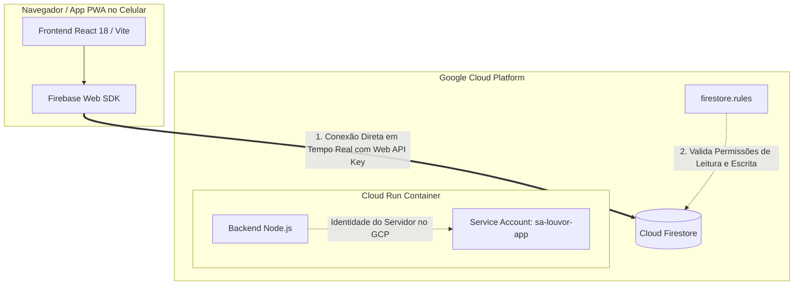

# 🎵 Louvor App - Ministério de Música (Mobile Native & Google Cloud Run)

Aplicativo moderno e completo para **Gestão do Ministério de Louvor**, com experiência 100% **Mobile Nativa (PWA)**, backend **Node.js** para hospedagem estática com SPA fallback e endpoints de API, persistência integrada ao **Cloud Firestore** e fallback local reativo.

---

## 📱 Funcionalidades e Destaques

### 1. 📅 Gestão de Escalas & Agenda
- **Edição Completa de Eventos**: Edite títulos, datas, horários, locais, setlist e integrantes de qualquer evento já criado.
- **Controle Individual de Presença com Cores Padrão**:
  - `✅ Confirmado / Vou`: Verde Esmeralda (`bg-emerald-600`) com anel de destaque.
  - `❌ Não vou`: Vermelho Rose (`bg-rose-600`) com anel de destaque.
  - `⏳ Pendente`: Âmbar / Laranja (`bg-amber-500`) com anel de destaque.
- **Configuração de Presença na Criação/Edição**: Ajuste o status de cada integrante diretamente na tela de edição com ações rápidas de lote (*Todos Confirmados* / *Todos Pendentes*).
- **Integração com WhatsApp**:
  - Envio individual de lembretes e escala no WhatsApp (`wa.me`) em 1 clique.
  - Compartilhamento formatado da escala completa para o grupo da igreja.

### 2. 🎵 Repertório Oficial & Importação do YouTube
- **Importação de Playlists do YouTube em Lote**: Cole o link de qualquer playlist pública do YouTube para importar dezenas de músicas automaticamente, com detecção de título, artista e capas.
- **Configuração em Lote**: Defina tom e estilo padrão para todas as faixas da playlist ou ajuste individualmente.
- **Cifra & Transposição de Tom**: Ferramenta interativa de **Transposição de Tom (+/- semitons)** para vocalistas e instrumentistas.
- **Player Embutido**: Vídeos e áudios do YouTube integrados de forma responsiva.
- **Filtros Inteligentes**: Filtros rápidos por Momento Litúrgico (Adoração, Celebração, Ministração, Abertura, Santa Ceia) e por Tom musical.

### 3. 🗳️ Músicas para Adoção & Aprovação do Líder
- **Sugestão de Canções**: Integrantes podem sugerir novas músicas com link do YouTube, tom sugerido, categoria e justificativa.
- **Votação Democrática**: Sistema de votos em tempo real (`❤️ Votar na Música`) com ordenação automática das mais votadas no topo.
- **Aprovação Exclusiva do Líder**: Canções sugeridas só entram no Repertório Oficial após aprovação de um membro com perfil de **Líder de Louvor**.
- **Painel do Líder**: Modal de homologação onde o líder define o tom oficial final, momento litúrgico e instruções de arranjo.

### 4. 👥 Gestão de Equipe & Múltiplas Funções
- **Múltipla Escolha de Funções**: Cada integrante pode desempenhar múltiplos papéis (ex: *Líder de Louvor*, *Violão*, *Vocal*, *Ministro de Louvor*).
- **Destaque Especial para Líderes**: Badge dourado com coroa 👑 (`Líder de Louvor`), borda destacada e avatar exclusivo.
- **Times Fixos & Escalas Avulsas**: Crie equipes pré-definidas (ex: *Time Alfa*, *Time Jovens*) para preenchimento rápido de escalas.

### 5. 📊 Métricas & Estatísticas do Ministério
- **Top Músicas Mais Tocadas**: Gráfico das canções mais executadas nos cultos.
- **Top Integrantes Escalados**: Ranking de participação dos voluntários e músicos.
- **Distribuição de Tons**: Visualização da variedade de tonalidades utilizadas nas ministrações.

### 6. ⚡ Arquitetura Resiliente & Modo Offline
- **Sincronização Cloud Firestore**: Conexão em tempo real com o banco de dados.
- **Fallback Local Automático**: Funcionamento offline transparente via `localStorage` com reatividade total se o Firestore não estiver acessível.

---

## 🚀 Como Executar Localmente

### Pré-requisitos
- **Node.js** v18+ e **npm**

### 1. Instalação das Dependências
```bash
# Na raiz do projeto:
npm --prefix frontend install && npm --prefix backend install
```

### 2. Executar o Frontend (Modo Dev com Hot-Reload)
```bash
npm --prefix frontend run dev
```
Acesse `http://localhost:5173` no navegador (recomendado inspecionar em modo Mobile no DevTools).

### 3. Executar o Backend
```bash
npm --prefix backend run dev
```
O servidor inicializa em `http://localhost:8080` (API com endpoints `/api/health`, `/api/info` e `/api/youtube/playlist`).

---

## 🛠️ Build para Produção

Para gerar o bundle compilado do frontend e backend:

```bash
# 1. Compilar Frontend
npm --prefix frontend run build

# 2. Copiar build do Frontend para a pasta pública do Backend
rm -rf backend/public && cp -r frontend/dist backend/public

# 3. Compilar Backend
npm --prefix backend run build

# 4. Executar em Produção
NODE_ENV=production npm --prefix backend start
```

---

## 📁 Estrutura do Projeto

```
app-louvor/
├── Dockerfile                    # Container multi-stage pronto para Cloud Run
├── .dockerignore                 # Ignora node_modules e arquivos temporários no Docker
├── .gitignore                    # Bloqueia .env, credenciais, builds e Makefile
├── .env.example                  # Modelo de variáveis de ambiente
├── README.md                     # Documentação completa do projeto
├── firestore.rules               # Regras de segurança do Firestore
├── frontend/                     # Aplicação React 18 + Vite + TypeScript + Tailwind CSS
│   ├── public/                   # Manifest PWA e ícones
│   ├── src/
│   │   ├── components/
│   │   │   ├── agenda/           # Escalas, detalhes, seletores de músicos e músicas
│   │   │   ├── playlist/         # Repertório, adoção de canções, importador do YouTube
│   │   │   ├── team/             # Integrantes, múltiplas funções, times
│   │   │   ├── metrics/          # Dashboard e estatísticas do ministério
│   │   │   ├── layout/           # BottomNav, Header e container mobile
│   │   │   └── ui/               # Botões, BottomSheet, Badges, Toasts
│   │   ├── config/               # Inicialização do Firebase Firestore
│   │   ├── services/             # Sincronização reativa e mockData
│   │   ├── types/                # Interfaces TypeScript do sistema
│   │   └── utils/                # WhatsApp, YouTube e Transpositor de Tom
│   └── vite.config.ts
└── backend/                      # Servidor Node.js / Express
    ├── src/
    │   └── server.ts             # Servidor SPA Fallback, /api/health e /api/youtube/playlist
    └── public/                   # Build estático do frontend servido em produção
```

---

## ☁️ Deploy no Google Cloud Run & Arquitetura Firestore

### 🏗️ Arquitetura de Autenticação e Acesso ao Banco (Opção 1: Conexão Direta)

O Louvor App utiliza uma arquitetura híbrida de alta performance e reatividade em tempo real:



1. **Frontend (Navegador do Usuário / PWA):**
   - O aplicativo executa o SDK Web do Firebase (`firebase/firestore`) diretamente no navegador do cliente para suportar sincronização reativa em tempo real (`onSnapshot`) e funcionamento offline resiliente via `localStorage`.
   - **Web API Key (`AIzaSy...`)**: É injetada no bundle JavaScript durante a etapa de build (`VITE_FIREBASE_API_KEY`). Ela serve como identificador de projeto para direcionar o tráfego do navegador aos servidores do Firestore.
   - **Segurança**: As permissões de acesso e integridade dos documentos são controladas diretamente pelas regras em [firestore.rules](file:///Users/marllonfernandes/Desenvolvimento/pessoal/app-louvor/firestore.rules).

2. **Backend (Google Cloud Run):**
   - O servidor Node.js/Express roda no Cloud Run sob a Service Account `sa-louvor-app@lab-resources.iam.gserviceaccount.com`.
   - O backend é responsável por servir a aplicação compilada (SPA Fallback), realizar healthchecks de infraestrutura e processar APIs auxiliares (como extração e importação de playlists do YouTube).

---

### 🔒 Restrições da Chave Web de API (Google Cloud Console)

Para manter o Princípio do Menor Privilégio e garantir a segurança da Web API Key pública:

- **Restrições de API (API Restrictions)**:
  - ✅ **Cloud Firestore API** *(Obrigatória para leitura, gravação e WebSockets)*
  - ✅ **Firebase Installations API** *(Recomendada para ciclo de vida do SDK)*

> [!NOTE]
> **Restrições de Aplicativo (Referenciadores HTTP)**:
> As restrições de referenciador HTTP (como `http://localhost:*` ou `https://*.run.app/*`) **não foram adicionadas**, permitindo que a chave opere de forma flexível em qualquer ambiente de desenvolvimento, preview ou produção.

---

### 🚀 Passo a Passo de Deploy e Inicialização

#### 1. Publicar as Regras de Segurança do Firestore
Publique as regras do arquivo `firestore.rules` no seu banco de dados:
```bash
make deploy-rules
```
*(Ou copie o conteúdo de `firestore.rules` e cole na aba **Regras** do Cloud Firestore no Firebase/GCP Console).*

#### 2. Executar o Deploy no Cloud Run
Submeta o build e deploy para o Google Cloud Run injetando a sua Web API Key:
```bash
make deploy-gcp VITE_FIREBASE_API_KEY=AIzaSySuaChaveWebAqui
```

#### 3. Gravar os Dados Iniciais no Cloud Firestore (Seed)
1. Abra a URL gerada pelo Cloud Run no navegador.
2. Clique no ícone de **Configurações** (sliders/engrenagem no cabeçalho superior).
3. Clique em **"Gravar Dados Iniciais no Firestore"**.
4. O app criará automaticamente os registros iniciais de músicas, escalas, equipes e membros no Firestore, passando a sincronizar instantaneamente entre todos os integrantes!

